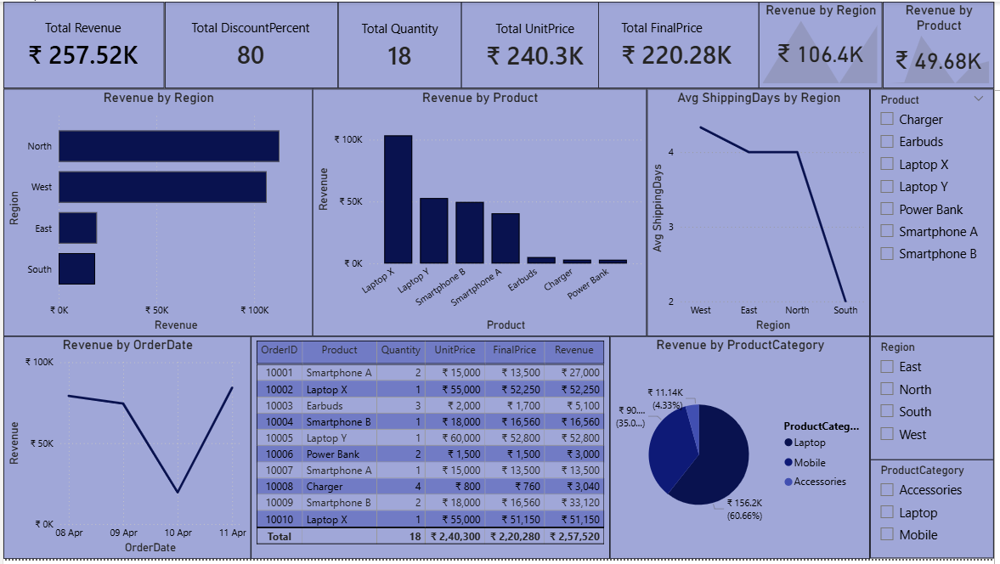

# Electronics store analysis

## Objective
An e-commerce electronics store wants to analyze orders to understand top-products,discount impact, and regional sales performance

## Tools Used
- Excel
- SQL
- Python (Pandas, Matplotlib)
- Power BI

## Dataset
- OrderID
- OrderDate
- Region
- ProductCategory
- Product
- Quantity
- UnitPrice
- DiscountPercent
- ShippingDays

## Analysis Performed
- Calculated DiscountAmount, FinalPrice, Revenue columns
- Evaluated top-performing product
- Compared electronics sales across different regions
- Analyzed sales by Product
- Evaluated ProductCategory performance
- Created visualizations

## Key Insights
- The North & West regions which have the highest sales should receive more inventory to meet demand and avoid stock shortages.
- Discounts increase sales volume but do not always improve revenue effectively, indicating the need for controlled discount strategies.
- The Laptop category contributes the highest sales and is the main revenue driver.
- Laptop X is the top-performing product amongst all products
- On the 11th April, 2026 had the highest revenue.
- Overall, Discounts has reduced the revenue, so it is recommended that first improve the quantity and then it is better to give discounts to improve their business growth.

## Files Included
- TASK 3.xlsx - Dataset and Pivot tables & charts
- TASK 3.sql - SQL Queries
- TASK 3.py - Python analysis
- TASK 3.pbix - Power BI Dashboard
- Screenshot.png - Screenshot of Dashboard

