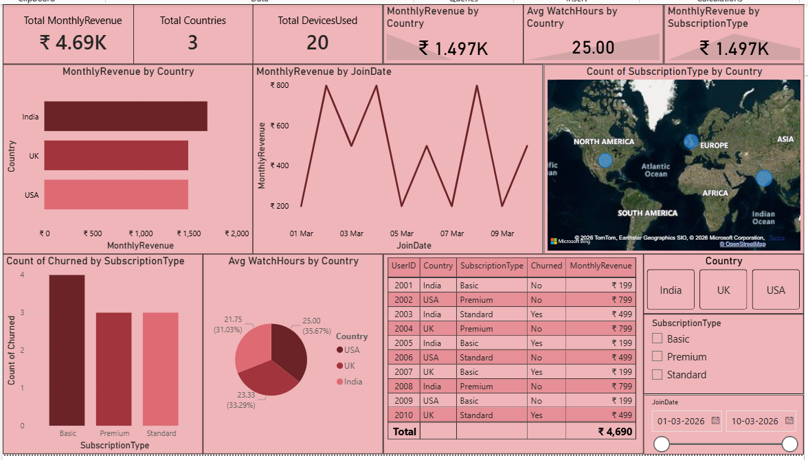

# Streaming Platform Analysis

## Objective
A subscription-based streaming platform wants to analyze user activity to understand user retention, subscription plans, and engegement trends.

## Tools Used
- Excel
- SQL
- Python (Pandas, Matplotlib)
- Power BI

## Dataset
- UserID
- JoinDate
- Country
- SubscriptionType
- MonthlyFee
- WatchHours
- DevicesUsed
- Churned

## Analysis Performed
- Analyzed MonthlyRevenue by Country
- Compared avg watchhours by Country
- Evaluated Churned rate by SubscriptionType
- Analyzed count of subscriptionType by Country
- Created visualizations

## Business Insights
- Premium and Standard subscription types need to be promoted more than the basic subscriptiontype
- India has dominated the other countries MonthlyRevenue
- Churn rate is higher in low-priced plans like Basic
- USA has the highest avg WatchHours than the other countries
- Improving Premium & Standard subscriptionTypes revenue is the retention strategy recommendation for business growth.

## Files Included
- TASK 4.xlsx - Dataset, Pivot tables & charts
- TASK 4.sql - SQL Queries
- TASK 4.py - Python analysis
- TASK 4.pbix - Power BI Dashboard
- Screenshot.png - Screenshot of Dashboard

