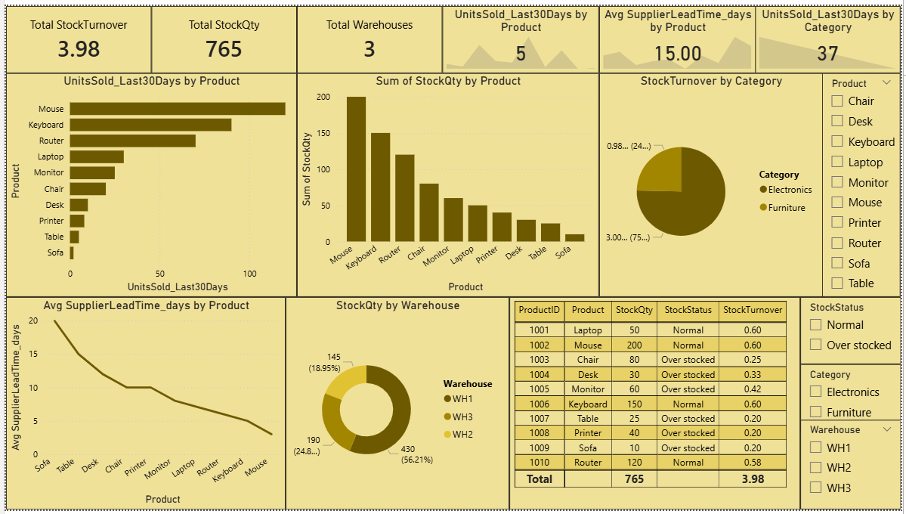

# Inventory & Stock Optimization

## Objective
A warehouse management team wants to analyze Over-stocked products, Under-stocked products, slow-moving inventory, and warehouse performance

## Tools Used
- Excel
- SQL
- Python (Pandas, Matplotlib)
- Power BI

## Dataset
- ProductID - Unique ID for each product
- Product - Name of the product
- Category - Type of product group
- WareHouse - Location where product is stored
- StockQty - No of Units currently available in the warehouse
- ReorderLevel - Min stock level before you need to reorder
- UnitsSold_Last30Days - No of units sold in the last 30 days
- SupplierLeadTime_days - No of days supplier takes to deliver new stock

## Analysis performed
- Calculated StockStatus, StockTurnOver columns to know the over-stock and low-stock products
- Evaluated top sold products in the last 30 days
- Analyzed StockQty by product
- Compared StockTurnover by Category
- Evaluated avg SupplierLeadTime_days by product
- Analyzed StockQty by WareHouse
- Created visualizations for better understanding

## Business Insights
- Chair, Desk, Monitor, Table, Printer and Sofa are overly stocked in the warehouses
- WH1 WareHouse has dominated the other warehouses StockQty
- Mouse has the highest stock quantity amongst all products
- Mouse is the top-performing product
- Electronics has dominated the other category StockTurnover
- WH1 WareHouse stock quantity has to be increased to improve the business faster

## Files Included
- TASK 5.xlsx - Dataset, Pivot tables & Charts
- TASK 5.sql - SQL Queries
- TASK 5.py - Python Analysis
- TASK 5.pbix - Power BI Dashboard
- Screenshot.png - Screenshot of Dashboard

