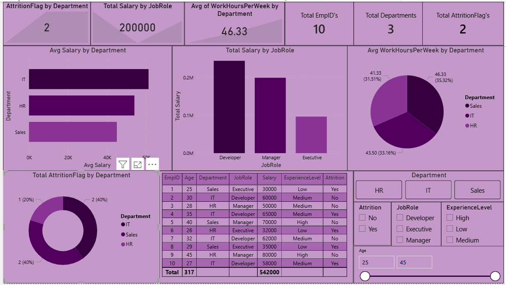

# HR Attrition Analysis

## Objective
Scenario:
If I'm working with a HR team. They want to understand:
- Why employees are leaving
- Which department have high attrition
- Whether salary and experience impact attrition

## Tools Used
- Excel
- SQL
- Python (Pandas, Matplotlib)
- Power BI

## Dataset
- EmpID - ID of the Employee
- Age - Age of the Employee
- Department - In which department the employee is working
- JobRole - JobRole of the Employee
- Salary - How much is the salary
- YearsAtCompany - Since how many years he has been working in the company
- WorkHoursPerWeek - How many hours the employee will work per week
- Attrition - Did the employee left the company

## Analysis Performed
- Calculated AttritionFlag, and Experience Level Columns
- Evaluated avg salary per Department
- Analysed total salary by JobRole
- Compared Avg WorkHoursPerWeek by Department
- Evaluated attrition rate by department
- Created Visualizations for better understanding

## Business Insights
- Employees seem to be leaving mainly due to lower salary and lower experience levels
- IT and Sales departments have higher attrition rate compared to HR
- Yes, employees with lower salaries and less experience are more likely to leave
- Developer role has dominated the other jobrole salaries
- Sales department have the highest avg workhoursperweek
- Attrition is higher in IT and Sales, so the company can consider reviewing salaries, especially for lower experience employees, along with improving career growth opportunities and work conditions

## Files Included
- TASK 6.xlsx - Dataset, Pivot tables and charts
- TASK 6.sql - SQL Queries
- TASK 6.py - Python analysis
- TASK 6.pbix - Power BI Dashboard

  
