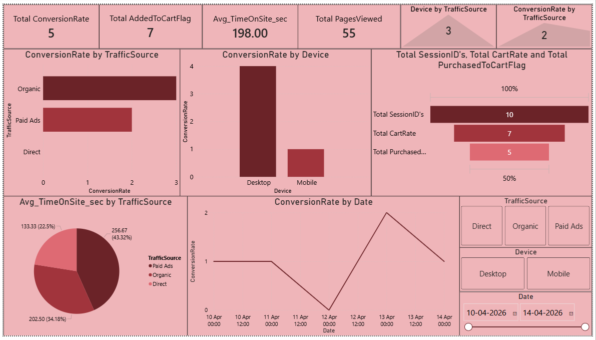

# Website Funnel & Coversion Analysis

## Objective
**Scenario** : 
Analyzing data for an e-commerce website. The marketing team wants to understand:
- Where users drop-off in the funnel
- Which trafficsource performs best
- How to improve conversions

## Tools Used
- Excel
- SQL
- Python (Pandas, Matplotlib)
- Power BI

## Dataset
- SessionID - A unique ID for each login
- Date - Date of login
- TrafficSource - the method through which visitors arrive at a website
- Device - From which device the user login to website
- PagesViewed - How many pages viewed by the user
- TimeOnSite_sec - How much time the user spends on the site
- AddedToCart - Did they added anything to cart
- Purchased - Did the user purchased something from the website

## Analysis performed
- Calculated Conversion rate and Cart rate
- Evaluated device performance
- Compared Conversion rate by TrafficSource
- Analyzed avg time on site by traffic source
- Created visualizations and interactive dashboard

## Business Insights
- The biggest drop happens before adding to cart, but both stages are almost equally weak
- Organic traffic source brings the highest quality users because it has the best conversion rate
- Desktop users convert much better than mobile users
- Paid Ads has the highest avg time spent on the website
- To increase revenue, we should improve the mobile user experience and focus on organic traffic source.

## Files Included
- TASK 7.xlsx - Dataset, Pivot tables and charts
- TASK 7.sql - SQL Queries
- TASK 7.py - Python Analysis
- TASK 7.pbix - Power BI Dashboard
- Screenshot.png - Screenshot of Dashboard

  
