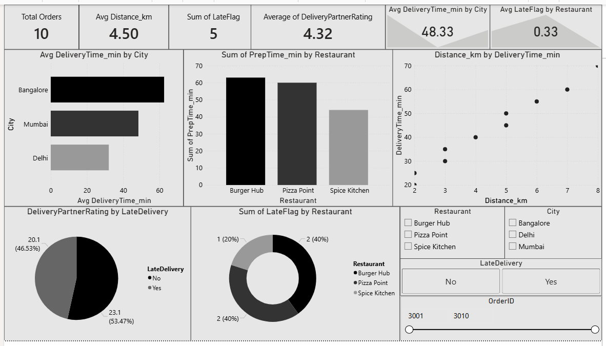

# Food Delivery Analysis

## Objective
**Scenario** - Working with a food delivery company. The team wants to understand:
- Late Deliveries
- Which restaurants cause delays
- Whether distance affects delivery time

## Tools Used
- Excel
- SQL
- Python (Pandas, Matplotlib)
- Power BI

## Dataset
- OrderID -  A unique ID for each order
- Restaurant - From which restaurant the food was taken to deliver
- City - In which city the food is ordering
- Distance_km - The distance from the delivery location
- DeliveryTime_min - How many minutes taken to deliver the order
- PrepTime_min - How many minutes taken to prepare the order
- DeliveryPartnerRating - How much is customer satisfied with the delivery
- LateDelivery - Is the order delivered late

## Calculated Columns
- LateFlag - Converting LateDelivery column into numerical values
- DeliverySpeed - How much is the delivery speed
- TotalTime - Total time to deliver the order to the customer

## Analysis Performed 
- Calculated LateFlag, DeliverySpeed, and TotalTime columns
- Analyzed delivery time by city
- Compared preparation time by restaurant
- Evaluated distance by delivery time
- Analyzed late deliveries by Restaurant
- Created visualizations for better understanding

## Business Insights
- Bangalore and Mumbai cities taking more time to deliver the orders
- Burger Hub and Pizza point restaurants are taking more time to prepare the orders
- Distance affects the delivery time, the distance increases eventually delivery time also increases
- Late deliveries has impacted DeliveryPartnerRating to some extent
- Bangalore and Mumbai cities have to decrease their delivery time and should improve speed
- Burger Hub and Pizza point restaurants has to decrease their preparation time and make order to deliver fast

## Files Included
- TASK 10.xlsx - Dataset, Pivot tables and charts
- TASK 10.sql - SQL Queries
- TASK 10.py - Python analysis
- TASK 10.pbix - Power BI Dashboard
- Screenshot.png - Screenshot of Dashboard

