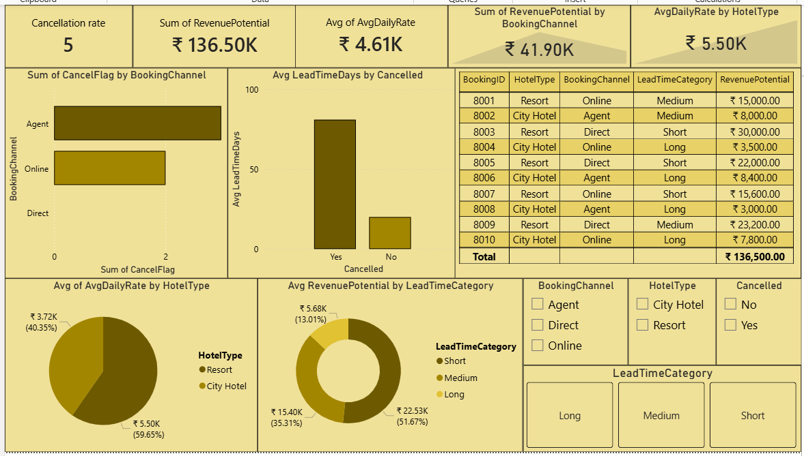

# Hotel Booking Analysis

## Objective
**Scenario -** Analyzing data for a hotel chain (like Marriott International or OYO Rooms). The business is facing:
- High booking Cancellations
- Revenue loss due to last-minute drop-offs
- Poor forecasting of occupancy

## Tools Used
- Excel
- SQL
- Python(Pandas, Matplotlib)
- Power BI

## Dataset
- BookingID - An unique ID for each booking
- HotelType - Type of the hotel the customer is booking
- LeadTimeDays - The number of the days between the date a guest makes a reservation and their scheduled arrival date
- StayDuration - How many days the guest is going to stay in the hotel
- Guests - How many members will stay in the hotel
- BookingChannel - How the customer booked the hotel
- AvgDailyRate - On an average what's the cost of staying in the hotel per day
- Cancelled - Did the customer cancelled the booking

## Calculated columns
- CancelFlag - Converted cancelled column into a numerical format
- RevenuePotential - What's the total revenue generating by each customer
- LeadTimeCategory - LeadTimeDays has been converted into category-wise distribution

## Analysis Performed
- Calculated CancelFlag, RevenuePotential and LeadTimeCategory columns
- Evaluated cancellationrate by hoteltype
- Analyzed RevenuePotential by bookingchannel
- Compared avg leadtimedays by cancellation rate
- Created visualizations for better understanding

## Business Insights
- Customers who booked a hotel through an agent were cancelling the most than other bookingchannels
- Resort has generating the more revenue than the other hoteltype
- Long Lead time has increased the cancellation rate
- No customer has cancelled the direct bookings of a hotel
- Focus more on short leadtimecategory as it generates the most revenue
- The business has to introduce the policy called "Cancellation fee"

## Files Included
- TASK 11.xlsx - Dataset, Pivot tables and charts
- TASK 11.sql - SQL Queries
- TASK 11.py - Python Analysis
- TASK 11.pbix - Power BI Dashboard
- Screenshot.png - Screenshot of dashboard

