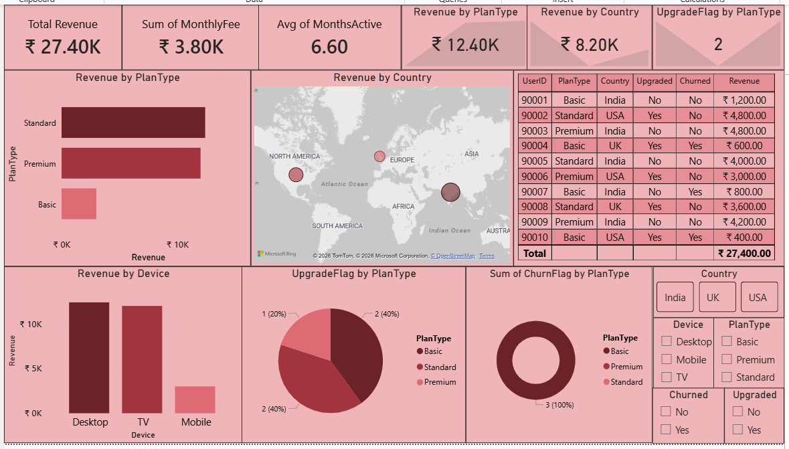

# Subscription Revenue & Customer Upgrade Analysis

## Objective 
**Scenario - ** Working for a SaaS company (like Netflix or Spotify). The product team wants to understand:
- Who upgrades their subscription
- Which plans generate the most revenue
- Whether premium plans are actually worth pushing

## Tools Used
- Excel
- SQL
- Python (Pandas, Matplotlib)
- Power BI

## Dataset
- UserID - An unique ID for each customer
- PlanType - Which plan the customer is using
- MonthlyFee - Amount of the plan for a month
- MonthsActive - How many months the customer paid the bill for that plan
- Upgraded - Moving from a low-level plan to higher-level plan
- Country - Which country the customer is belonging to
- Device - From which device the customer is using our service
- Churned - Did the customer left our platform

## Calculated columns
- Revenue - Total amount generated by each customer
- UpgradeFlag - Converted upgraded column into numerical values
- ChurnFlag - Converted Churned column into numerical values

## Analysis Performed
- Calcualted revenue, upgradeflag and churnflag columns
- Evaluated revenue by each plantype
- Compared revenue by each country
- Analyzed each device performance
- Computed upgrade rate by plantype
- Interpreted the churn rate
- Designed an interactive dashboard for better understanding

## Business Insights
- Standard and Premium plans are generating the highest revenue
- India has been generating the highest revenue
- Mobile users are the lowest revenue genrated customers
- Customers who are using low-budget plans are likely upgrading more
- Most of the customers from the basic plan are leaving the platform more
- The business has to push the standard and premium plans more as they are the generating the highest revenue
- Low-budget plans are upgrading more, so invest more on high-budget plans
- The business has to publish more about the features and benefits of making a subscription

## Files Included
- TASK 12.xlsx - Dataset, Pivot tables and Charts
- TASK 12.sql - SQL Queries
- TASK 12.py - Python Analysis
- TASK 12.pbix - Power BI Dashboard
- Screenshot.png - Screenshot of dashboard

