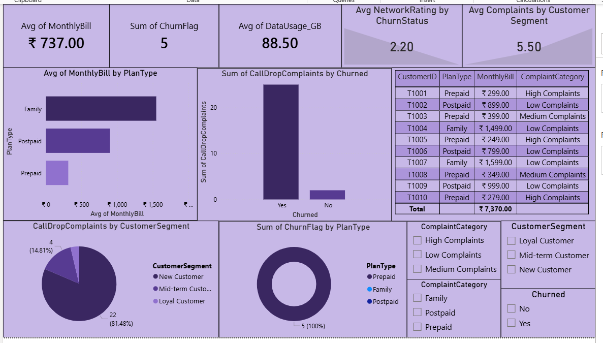

# Telecom Customer Churn & Network Quality Analysis

## Objective
**Scenario**- Working for a telecom company like Jio or Airtel.
The company is losing subscribers because of:
- Poor Network Quality
- High complaint volumes
- Customer switching to competitors

## Tools Used
- Excel
- SQL
- Python (Pandas, Matplotlib)
- Power BI

## Dataset
- CustomerID - An unique ID for each customer
- PlanType - Which subscription plan the customer is using
- MonthlyBill - Monthly pay for that particular plan
- DataUsage_GB - How much data is used by customer in a month
- Calldrop Complaints - How many times the customer has reported a complaint
- NetworkRating - Rating the network performance out of 5
- Tenure_Months - Since how many months he has been a customer with us
- Churned - Is he left our platform

## Calculated Columns
- Churn Flag - Converted churned column into numericals
- Complaint Category - Divided complaints into categories based on their complaint number
- CustomerSegment - Categorized customers based on their spending months with us

## Analysis Performed
- Calculated churn flag, complaint category and customer segemnt columns
- Evaluated churn rate by planType
- Analyzed avg network rating by churn status
- Calculated monthly pay by planType
- Categorized customer segment distribution
- Analyzed plan wise churn rate

## Key Insights
- Family PlanType has generated the most revenue among other planTypes
- New customers are having more complaints than the others
- Mostly Prepaid customers are leaving the platform due to poor service quality
- Network complaints strongly affect churn rate
- Overall, I strongly recommend the company has to invest first on network infrastructure than retention offers after that it can focus on the retention rate

## Files Included
- TASK 14.xlsx - Dataset and Pivot tables
- TASK 14.sql - SQL Queries
- TASK 14.py - Python Analysis
- TASK 14.pbix - Power BI Dashboard
- Screenshot.png - Screenshot of Dashboard

