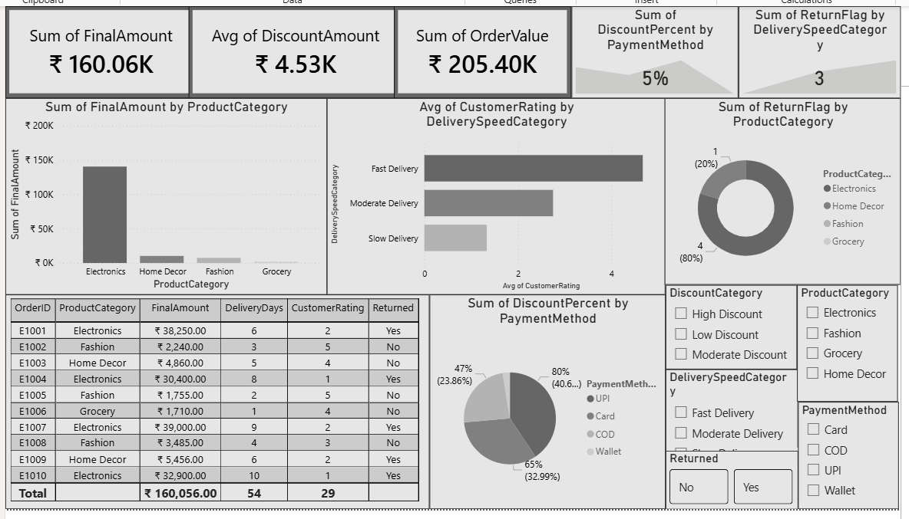

# E-Commerce Return & Customer Satisfaction Analysis

**Scenario** - Working for an e-commerce company like Amazon or Flipkart.
- Increasing product return rates
- Negative customer reviews
- High returns in some product categories

## Tools Used
- Excel
- SQL
- Python (Pandas, Matplotlib)
- Power BI

## Dataset
- OrderID - Unique ID for each order
- ProductCategory - Divided products into different categories
- OrderValue - Amount for order
- DeliveryDays - How many days took to deliver order
- CustomerRating - How much rating given by the customer
- Returned - Is the order returned
- PaymentMethod - Payment done via which method
- DiscountPercent - How much discount was given

## Calculated Columns
- DiscountAmount - Converted percentage into amount
- FinalAmount - Calculated final amount
- ReturnFlag - Converted returned into numbers
- DeliverySpeedCategory - Categorized deliveryspeed into categories
-  DiscountCategory - Categorized discount into categories

## Analysis Performed
- Calculated some columns for better results
- Analyzed discount percent on return status
- Evaluated which product categories are returned more
- Analyzed whether delay deliveries impacted on customer rating
- Calculated avg discount percent based on the payment method
- Calcualted each product category revenue

## Key Insights
- Grocery and Fashion categories are generating the least revenue
- Slow deliveries are highly impacted on customer ratings
- Mostly UPI & Card payment methods are getting more discounts on products
- Electronics products are returned more
- Mostly discounted products are returning more
- Orders delivered after 7 days show significantly lower customer ratings and higher return rates
- Company should mainly focus on improving the delivery speed and should reduce the discounts
- If the company wants to give discounts  then it should improve quantity and then it's good to give disounts

## Files Included
- TASK 15.xlsx - Dataset, Pivot tables and Charts
- TASK 15.sql - SQL Queries
- TASK 15.py - Python analysis
- TASK 15.pbix - Power BI Dashboard
- Screenshot.png - Screenshot of dashboard

