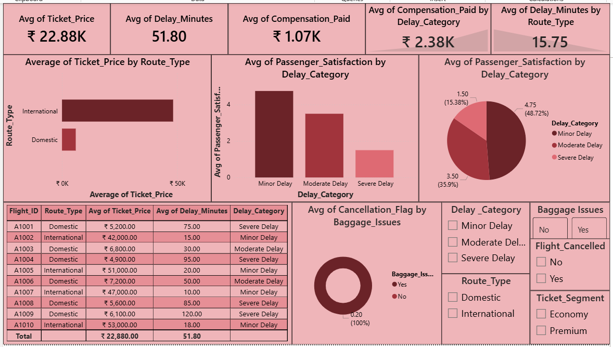

# AIRLINE PASSENGER EXPERIENCE & FLIGHT DELAY ANALYSIS

## OBJECTIVE 
**SCENARIO** - Working for an airline company like Indigo or Air India.
The airline is dealing with:
- Frequent flight delays
- Low passenger satisfaction ratings
- Increasing compensation costs due to delayed flights

## TOOLS USED
- Excel
- SQL
- Python (Pandas, Matplotlib)
- Power BI

## DATASET 
- Flight_ID - An unique ID for each flight
- Route_Type - Through which route the flight is travelling
- Delay_Minutes - How much time the flight was delayed
- Ticket_Price - Price of the ticket
- Passenger_Satisfaction - Passenger satisfaction rating based on their flight experience
- Compensation_Paid - Compensation paid for delaying the flight
- Baggage_Issues - Whether the passenger has faced any baggage issues
- Flight_Cancelled - Whether the flight has been cancelled or not

 ## CALCULATED COLUMNS 
 - Cancellation_Flag - Converted Cancelled column into numbers
 - Delayed_Category - Categorized Delay minutes based on their late
 - Ticket_Segment - Categorized tickets into segments based on their ticket price

## ANALYSIS PERFORMED
- Calculated Cancellation_Flag, Delayed_Category and Ticket_Segment columns 
- Calculated Avg_ticket price by route type
- Categorized Avg_Passenger_Satisfaction by Delay_Category
- Evaluated avg compensation paid by ticket segment
- Analyzed avg delay minutes by route type

## KEY INSIGHTS 
- International route type has generated more revenue than the domestic route type
- Severe delayed flights have impacted badly on passenger satisfcation rating
- Economy segment has paid the highest compensation
- Domestic route type flights have been delaying more
- Customers who faced baggage issues have been cancelling the flights more
- Overall, "Domestic routes experience the highest avg delays and compensation payouts, with passenger satisfaction dropping sharply after delays exceed 60 minutes, indicating operational inefficiencies are directly affecting customer experience and costs."

 ## FILES INCLUDED
 - TASK 17.xlsx - Dataset
 - TASK 17.sql - SQL Queries
 - TASK 17.py - Python Analysis
 - TASK 17.pbix - Power BI Dashboard
 - Screenshot.png - Screenshot of dashboard

   
