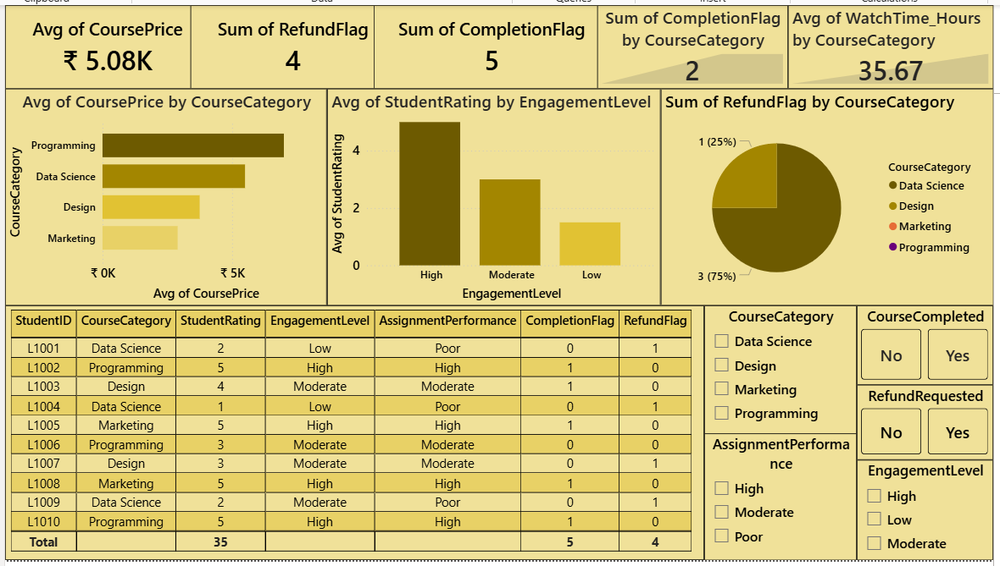

# ONLINE EDUCATION PLATFORM PERFORMANCE & STUDENT RETENTION ANALYSIS

## OBJECTIVE
**Scenario** - You're working for an online learning platform like Coursera or Udemy
The platform is facing:
- Low course completion rates
- Declining student engagement
- High refund requests in some course categories

## TOOLS USED 
- Excel
- SQL
- Python (Pandas, Matplotlib)
- Power BI
  
## DATASET
- StudentID - An unique ID for each student
- CourseCategory - Which course has the student opted for
- CoursePrice - The price for the course
- WatchTime_Hours - How many hours the student has watched the classes
- AssignmentsCompleted - How many assignments has completed by the student
- StudentRating - What's the student performance
- RefundRequested - Whether student has requested for refund
- CourseCompleted - Whether student has completed the course or not

## CALCULATED COLUMNS 
- CompletionFlag - Converted CourseCompleted into numerical columns
- EngagementLevel - Converted watchtime into engagement level
- AssignmentPerformance - Calculated the student's performance based on their completion of assignments

## ANALYSIS PERFORMED 
- Calculated Completion Flag, Engagement Level and Assignment Performance columns
- Evaluated completion rate by course category
- Analyzed engagement level by student rating
- Calculated course price by course category
- Distributed refund rate by course category
- Compared watch time hours by assignments completed

## KEY INSIGHTS
- Data Science course category has the lowest completion rate
- High engagement level is directly proportional to high student rating
- Refunds are linked to low ratings and low participation
- Marketing and Programming course categories have no refund issues
- Programming course category has highest price among all categories
- Students who watch more content complete courses more often
- Data Science courses show the lowest completion rates and highest refund requests, especially among students with low watch time and assignment participation, indicating engagement challenges and possible content complexity issues

## FILES INCLUDED
- TASK 18.xlsx - Dataset
- TASK 18.sql - SQL Queries
- TASK 18.py - Python Analysis
- TASK 18.pbix - Power BI Dashboard
- Screenshot.png - Screenshot of Dashboard

